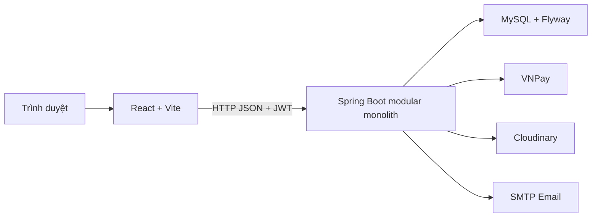
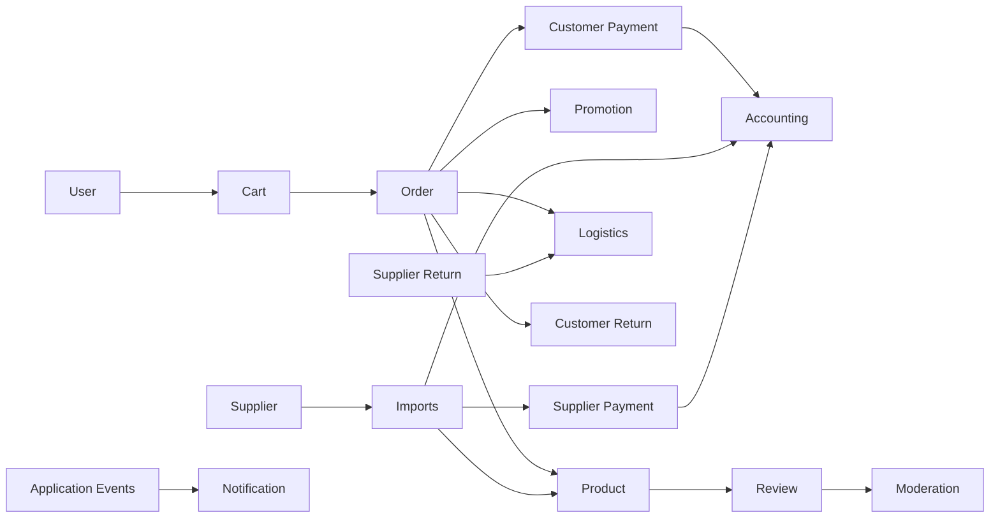

# NewToyStore - Hệ thống thương mại điện tử đồ chơi

## 1. Tổng quan

NewToyStore là dự án full-stack quản lý cửa hàng và bán đồ chơi trực tuyến. Hệ thống phục vụ khách hàng, nhân viên, quản lý và quản trị viên qua một React SPA và một Spring Boot REST API.

Các nghiệp vụ hiện có gồm danh mục, sản phẩm và biến thể, tồn kho, giỏ hàng, đặt hàng, COD/VNPay, giao vận nội bộ, khuyến mãi, đánh giá, trả hàng, nhà cung cấp, nhập hàng, công nợ nhà cung cấp, thông báo, thống kê và kế toán kép nội bộ.

Backend được tổ chức theo modular monolith và DDD Lite. Đây không phải kiến trúc microservices; toàn bộ domain chạy trong một ứng dụng và dùng chung một MySQL schema.

## 2. Công nghệ

### Backend

- Java 21, Spring Boot 3.3.5 và Maven Wrapper.
- Spring Web, Spring Data JPA, Hibernate và Bean Validation.
- Spring Security, JWT `0.11.5` và BCrypt.
- MySQL và Flyway.
- Springdoc OpenAPI `2.6.0`.
- Spring Mail, Cloudinary SDK `2.4.0` và VNPay sandbox integration.
- Lombok và mapper viết tay.

### Frontend

- React `18.3.1`, React DOM và React Router `6.28.0`.
- Vite `6.0.1`.
- Recharts, React Flow, Dagre và React D3 Tree.
- Native `fetch` qua API client dùng chung.

## 3. Kiến trúc



Trong backend, controller nhận DTO và chuyển use case tới service/facade. Domain sở hữu entity và business rule; repository abstraction nằm cùng domain. `global` chứa base entity, event và exception dùng chung; `infrastructure` chứa security, schedule và adapter dịch vụ ngoài.

Giao tiếp liên module dùng ID, facade/application interface hoặc Spring application event tùy luồng. Source vẫn còn một số dependency trực tiếp giữa application service và DTO/module khác; các điểm này được ghi trong README domain tương ứng.

## 4. Cấu trúc dự án

```text
NewToyStore/
|- frontend/          React/Vite storefront và trang quản trị
|- new_toy_store/     Spring Boot REST API
|- .gemini/           Quy tắc hỗ trợ phát triển giao diện
|- .gitignore
`- README.md
```

Tài liệu chi tiết:

- [Frontend](frontend/README.md)
- [Backend](new_toy_store/README.md)

## 5. Bản đồ domain backend

| Module | Trách nhiệm | README |
|---|---|---|
| Accounting | Sổ kế toán kép và dòng tiền nội bộ | [accounting](new_toy_store/src/main/java/com/example/new_toy_store/accounting/README.md) |
| Admin | Tổng hợp badge menu quản trị | [admin](new_toy_store/src/main/java/com/example/new_toy_store/admin/README.md) |
| Cart | Giỏ hàng và khởi tạo checkout | [cart](new_toy_store/src/main/java/com/example/new_toy_store/cart/README.md) |
| Category | Cây danh mục nhiều cấp | [category](new_toy_store/src/main/java/com/example/new_toy_store/category/README.md) |
| Customer Payment | COD, VNPay và hoàn tiền | [customer_payment](new_toy_store/src/main/java/com/example/new_toy_store/customer_payment/README.md) |
| Customer Return | Yêu cầu trả hàng và kiểm định | [customer_return](new_toy_store/src/main/java/com/example/new_toy_store/customer_return/README.md) |
| Imports | Phiếu nhập từ nhà cung cấp | [imports](new_toy_store/src/main/java/com/example/new_toy_store/imports/README.md) |
| Logistics | Shipment và tracking đa chiều | [logistics](new_toy_store/src/main/java/com/example/new_toy_store/logistics/README.md) |
| Moderation | Danh sách từ khóa kiểm duyệt | [moderation](new_toy_store/src/main/java/com/example/new_toy_store/moderation/README.md) |
| Notification | Thông báo và preference người dùng | [notification](new_toy_store/src/main/java/com/example/new_toy_store/notification/README.md) |
| Order | Đơn hàng, item snapshot và lịch sử | [order](new_toy_store/src/main/java/com/example/new_toy_store/order/README.md) |
| Product | Sản phẩm, biến thể, hình ảnh và tồn kho | [product](new_toy_store/src/main/java/com/example/new_toy_store/product/README.md) |
| Promotion | Khuyến mãi theo sản phẩm/đơn/vận chuyển | [promotion](new_toy_store/src/main/java/com/example/new_toy_store/promotion/README.md) |
| Review | Đánh giá, media, reply và trạng thái hiển thị | [review](new_toy_store/src/main/java/com/example/new_toy_store/review/README.md) |
| Statistics | Read model và báo cáo quản trị | [statistics](new_toy_store/src/main/java/com/example/new_toy_store/statistics/README.md) |
| Supplier | Hồ sơ và trạng thái nhà cung cấp | [supplier](new_toy_store/src/main/java/com/example/new_toy_store/supplier/README.md) |
| Supplier Payment | Hóa đơn phải trả và giao dịch thanh toán NCC | [supplier_payment](new_toy_store/src/main/java/com/example/new_toy_store/supplier_payment/README.md) |
| Supplier Return | Trả hàng về nhà cung cấp | [supplier_return](new_toy_store/src/main/java/com/example/new_toy_store/supplier_return/README.md) |
| Upload | Upload ảnh/video lên Cloudinary | [upload](new_toy_store/src/main/java/com/example/new_toy_store/upload/README.md) |
| User | Tài khoản, xác thực, hồ sơ và địa chỉ | [user](new_toy_store/src/main/java/com/example/new_toy_store/user/README.md) |
| Warehouse | View điều phối kho trên Imports/Product | [warehouse](new_toy_store/src/main/java/com/example/new_toy_store/warehouse/README.md) |

`global` và `infrastructure` là vùng kỹ thuật dùng chung, không phải business domain độc lập nên không có domain README riêng.

## 6. Tương tác domain



Luồng command có side effect thường phát application event sau khi nghiệp vụ nguồn hoàn thành. Luồng đọc liên module chủ yếu dùng facade hoặc application query. Đây là giao tiếp in-process, không có message broker hoặc distributed transaction.

## 7. Luồng nghiệp vụ chính

### Mua hàng

```text
Xem sản phẩm -> thêm giỏ hàng -> checkout -> tạo đơn
-> giữ tồn kho -> COD hoặc VNPay -> tạo shipment -> hoàn thành đơn
```

### Nhập hàng và công nợ

```text
Chọn NCC -> tạo phiếu nhập -> hoàn thành phiếu
-> cập nhật tồn kho -> tạo khoản phải trả NCC
-> thanh toán NCC khi quỹ nội bộ đủ
```

### Hạch toán nội bộ

```text
Payment / Refund / Import / Supplier Payment
-> event AFTER_COMMIT -> bút toán cân bằng Nợ/Có
-> nhật ký chung / sổ cái / báo cáo
```

### Hậu mãi

Đơn hàng đã mua cung cấp ngữ cảnh cho review và customer return. Return phối hợp logistics, kiểm định, hoàn tiền và điều chỉnh tồn kho thông qua facade/event hiện có.

## 8. Dữ liệu và persistence

- MySQL là database chính.
- Flyway migrations hiện có từ `V1` đến `V11`; các migration mới nhất bổ sung hoàn tiền một phần, đồng bộ trạng thái trả hàng và tài khoản tiền khách trả trước `3388`.
- Hibernate đang cấu hình `ddl-auto: update`; vì vậy Flyway và Hibernate hiện cùng tham gia quản lý schema.
- `BaseRootEntity` cung cấp optimistic version; base entity dùng timestamp và soft delete.
- Hibernate batch fetching là `100`, JDBC batch size là `50`, Open Session in View bị tắt.
- Order item và một số record lịch sử lưu snapshot để dữ liệu cũ không đổi khi catalog thay đổi.
- Một số write path nhạy cảm dùng optimistic hoặc pessimistic locking tùy domain.

## 9. Quy ước API

- Request/response DTO tách khỏi JPA entity.
- Bean Validation được áp dụng tại API boundary.
- Endpoint danh sách thường dùng `Pageable`, filtering và sorting.
- Exception handler theo domain kết hợp global exception handling.
- Path hiện chưa đồng nhất hoàn toàn: tồn tại cả `/api/...`, `/api/v1/...` và endpoint không có prefix `/api`.
- Không có response wrapper duy nhất áp dụng cho mọi endpoint.

## 10. Bảo mật

- Xác thực stateless bằng JWT Bearer token.
- Password được encode bằng BCrypt.
- Vai trò hiện có: `CUSTOMER`, `STAFF`, `MANAGER`, `ADMIN`.
- Registration, login, password recovery, catalog read và VNPay callback được mở theo security config.
- Controller và security matcher cùng áp dụng role cho các tác vụ quản trị.
- Không đưa secret hoặc credential thật vào repository; cấu hình lấy từ environment.

## 11. Cài đặt và chạy

### Yêu cầu

- JDK 21.
- MySQL.
- Node.js và npm.

### Biến môi trường backend

Các nhóm biến đang được `application.yml` sử dụng:

```text
DB_URL, DB_USERNAME, DB_PASSWORD, PORT
FRONTEND_BASE_URL, BACKEND_BASE_URL
MAIL_HOST, MAIL_PORT, MAIL_USERNAME, MAIL_PASSWORD
JWT_SECRET, DEFAULT_AVATAR_URL
VNPAY_ENABLED, VNPAY_PAY_URL, VNPAY_REFUND_URL
VNPAY_TMN_CODE, VNPAY_HASH_SECRET
CLOUDINARY_CLOUD_NAME, CLOUDINARY_API_KEY, CLOUDINARY_API_SECRET, CLOUDINARY_FOLDER
SEED_ADMIN_*, SEED_STAFF_*, SEED_MANAGER_*, SEED_CUSTOMER_*
```

Backend hỗ trợ đọc `.env` tại root chạy hoặc `new_toy_store/.env`. Không commit giá trị thật của các biến bí mật.

### Chạy backend

```powershell
cd new_toy_store
.\mvnw.cmd spring-boot:run
```

### Chạy frontend

```powershell
cd frontend
npm install
npm run dev
```

Frontend đọc `VITE_API_URL`; khi không cấu hình sẽ dùng `http://localhost:8080`.

## 12. Tài liệu API

Khi backend đang chạy:

- Swagger UI: `http://localhost:8080/swagger-ui.html`
- OpenAPI JSON: `http://localhost:8080/v3/api-docs`

## 13. Trạng thái hiện tại

- Backend và frontend cho các luồng commerce chính đã có implementation.
- Trang quản trị có UI cho catalog, order, payment, supplier/import, return, logistics, notification, statistics và accounting.
- VNPay, Cloudinary và email phụ thuộc cấu hình môi trường bên ngoài.
- Accounting chỉ theo dõi nội bộ, không kết nối ngân hàng thật.

## 14. Hạn chế và hướng phát triển

- Chuẩn hóa một cơ chế quản lý schema thay vì dùng đồng thời Flyway và `ddl-auto: update`.
- Chuẩn hóa API prefix và response contract.
- Bổ sung transactional outbox nếu event cần bền vững khi tách process.
- Giảm application-level coupling còn lại giữa một số module.
- Sửa các chuỗi tiếng Việt bị sai encoding trong source/migration cũ.
- Dùng `DECIMAL`/`BigDecimal` nếu chuyển dự án sang xử lý tài chính thực tế.

## 15. Điều hướng tài liệu

- [Hướng dẫn backend và danh sách domain](new_toy_store/README.md)
- [Kiến trúc frontend](frontend/README.md)
- [Accounting](new_toy_store/src/main/java/com/example/new_toy_store/accounting/README.md)
- [Order](new_toy_store/src/main/java/com/example/new_toy_store/order/README.md)
- [Product](new_toy_store/src/main/java/com/example/new_toy_store/product/README.md)
- [Supplier Payment](new_toy_store/src/main/java/com/example/new_toy_store/supplier_payment/README.md)
