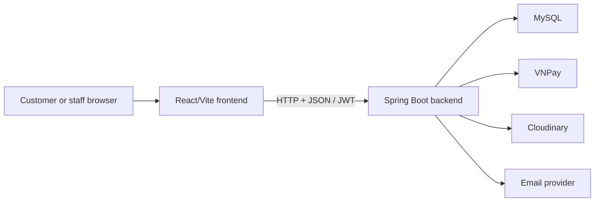

# NewToyStore

NewToyStore is a full-stack toy-store management and e-commerce system. The repository contains a React/Vite client and a Spring Boot backend organized as a modular monolith.

## Applications

| Application | Responsibility | Documentation |
|---|---|---|
| Frontend | Customer storefront and role-based administration interface | [Frontend README](frontend/README.md) |
| Backend | REST API, business rules, persistence, authentication and integrations | [Backend README](new_toy_store/README.md) |

## Repository structure

```text
NewToyStore/
|- frontend/          React 18 and Vite client
|- new_toy_store/     Java 21 and Spring Boot API
`- README.md          System-level documentation
```

The frontend calls the backend over HTTP. Authentication uses a JWT stored by the client and sent in the `Authorization` header. The backend owns business state in MySQL and integrates with services such as VNPay, Cloudinary and email.



## Main capabilities

- Customer catalog browsing, cart, checkout, payments, orders and shipment tracking.
- Customer profiles, notifications, reviews and return requests.
- Administrative catalog, inventory, suppliers, imports and logistics workflows.
- Administrative payments, refunds, promotions, moderation, users and statistics.
- Internal double-entry accounting, supplier liabilities and management reporting.

## Quick start

### Backend

Requirements: JDK 21 and MySQL.

```powershell
cd new_toy_store
.\mvnw.cmd spring-boot:run
```

The default backend address is `http://localhost:8080`. See the [backend setup guide](new_toy_store/README.md#setup-and-run) for supported environment variables and integration configuration.

### Frontend

Requirements: Node.js and npm.

```powershell
cd frontend
npm install
npm run dev
```

Set `VITE_API_URL` when the backend is not available at `http://localhost:8080`. See the [frontend setup guide](frontend/README.md#setup-and-run) for more details.

### VNPay sandbox card

These credentials are provided by the VNPay sandbox and are not real banking information:

| Field | Value |
|---|---|
| Bank | NCB |
| Card number | `9704198526191432198` |
| Cardholder | `NGUYEN VAN A` |
| Issue date | `07/15` |
| OTP | `123456` |

Choose VNPay during checkout and enter the values above on the sandbox payment page. If the payment page is closed before completion, open **Order history -> Order details -> Pay now with VNPay** to generate a new valid payment URL for the pending transaction.

## Documentation map

- [Frontend architecture and development guide](frontend/README.md)
- [Frontend pages and feature documentation](frontend/README.md#feature-documentation)
- [Backend architecture and development guide](new_toy_store/README.md)
- [Backend domain documentation](new_toy_store/README.md#domain-documentation)

## Documentation responsibility

Use this file only for system-wide concerns. Put frontend-specific information in `frontend/README.md`, backend-specific information in `new_toy_store/README.md`, and feature details in the README closest to the relevant source code.
