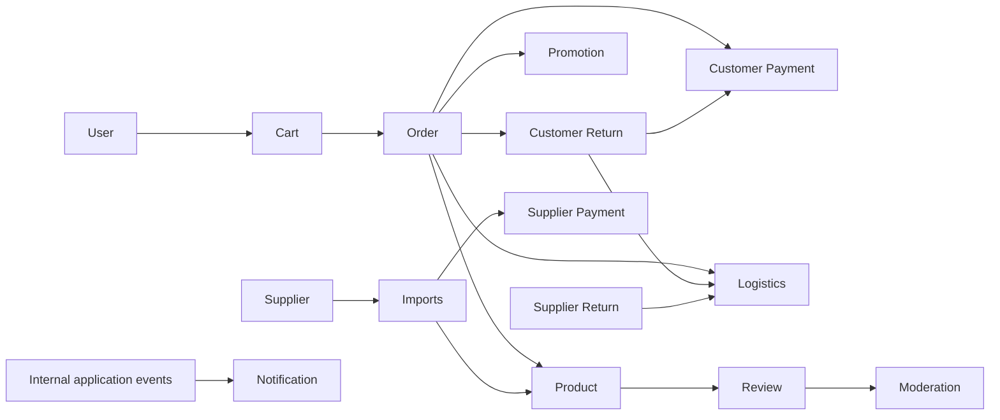

# NewToyStore - Toy Store API

## 1. Overview

NewToyStore is an e-commerce system for a toy retailer. The Spring Boot backend covers catalog and category management, inventory and imports, carts and orders, customer and supplier payments, forward and return logistics, promotions, reviews and moderation, notifications, users, and administrative statistics. A React/Vite frontend is included in `frontend/`.

The backend is implemented as a modular monolith: business capabilities are separated into top-level packages, while one Spring Boot process and one MySQL schema host the system. Most cross-module persistence references are scalar IDs; orchestration uses application facades and Spring application events. This is compatible with later service extraction, but the current code is not a microservice system.

## 2. Tech Stack

- Java 21, Spring Boot 3.3.5, Maven Wrapper.
- Spring Web, Bean Validation, Spring Data JPA/Hibernate, Spring Security.
- Stateless JWT authentication with JJWT 0.11.5 and BCrypt password hashing.
- MySQL and Flyway; Hibernate schema mode is currently `update`.
- Spring Mail, Cloudinary SDK 2.4.0, VNPay HTTP integration.
- Lombok; mapping is implemented with handwritten mapper classes (MapStruct is not present).
- Frontend: React 18.3, React Router 6.28, Vite 6, Recharts and React Flow/Dagre.

## 3. Architecture

```text
HTTP Controller + request/response DTO
                 |
                 v
Application Service / Facade
                 |
                 v
Domain Entity + Repository abstraction
                 |
                 v
Spring Data JPA / external infrastructure
```

The code demonstrates DDD Lite and separation of concerns through domain entities with lifecycle rules, repository interfaces, application orchestration, DTO isolation, specifications, exception advice, and domain-oriented packages. Cross-domain work uses IDs, public facades, and events in many flows. Some services still directly import another module's application or domain types, so isolation is pragmatic rather than strict Clean Architecture.

## 4. Project Structure

```text
NewToyStore/
|- frontend/                       React/Vite client
|- new_toy_store/                  Spring Boot backend
|  |- src/main/java/com/example/new_toy_store/
|  |  |- admin/                    Aggregated admin menu badges
|  |  |- cart/                     Shopping carts and checkout initiation
|  |  |- category/                 Hierarchical catalog categories
|  |  |- customer_payment/         COD/VNPay payment and refund records
|  |  |- customer_return/          Customer return lifecycle
|  |  |- imports/                  Supplier inbound notes
|  |  |- logistics/                Multi-direction shipments and tracking
|  |  |- moderation/               Review blacklist vocabulary
|  |  |- notification/             In-app/email notification preferences
|  |  |- order/                    Orders, items, history and lifecycle
|  |  |- product/                  Products, variants, media and inventory
|  |  |- promotion/                Product/order/shipping discounts
|  |  |- review/                   Verified-purchase reviews and media
|  |  |- statistics/               Administrative reporting queries
|  |  |- supplier/                 Supplier master data
|  |  |- supplier_payment/         Supplier invoices and payments
|  |  |- supplier_return/          Returns from store to supplier
|  |  |- upload/                   Cloudinary media upload adapter
|  |  |- user/                     Accounts, authentication and addresses
|  |  |- warehouse/                Warehouse-oriented import workflow
|  |  |- global/                   Shared base entities, events and errors
|  |  `- infrastructure/           Security, schedules, integrations, specs
|  `- src/main/resources/db/migration/
`- README.md
```

## 5. Domain Map

| Module | Responsibility | Documentation |
|---|---|---|
| Admin | Aggregated operational badge counts | [admin](new_toy_store/src/main/java/com/example/new_toy_store/admin/README.md) |
| Cart | Per-user cart, selection, synchronization and checkout request | [cart](new_toy_store/src/main/java/com/example/new_toy_store/cart/README.md) |
| Category | Category tree, visibility, moves and cycle prevention | [category](new_toy_store/src/main/java/com/example/new_toy_store/category/README.md) |
| Customer Payment | COD/VNPay payments and refunds | [customer_payment](new_toy_store/src/main/java/com/example/new_toy_store/customer_payment/README.md) |
| Customer Return | Customer return, inspection, dispute and refund lifecycle | [customer_return](new_toy_store/src/main/java/com/example/new_toy_store/customer_return/README.md) |
| Imports | Supplier inbound notes and inventory receipt | [imports](new_toy_store/src/main/java/com/example/new_toy_store/imports/README.md) |
| Logistics | Forward, customer-return and supplier-return shipments | [logistics](new_toy_store/src/main/java/com/example/new_toy_store/logistics/README.md) |
| Moderation | Cached blacklist terms for review moderation | [moderation](new_toy_store/src/main/java/com/example/new_toy_store/moderation/README.md) |
| Notification | Event-driven notification delivery and preferences | [notification](new_toy_store/src/main/java/com/example/new_toy_store/notification/README.md) |
| Order | Order snapshots and controlled lifecycle | [order](new_toy_store/src/main/java/com/example/new_toy_store/order/README.md) |
| Product | Catalog, variants, attributes, media and stock | [product](new_toy_store/src/main/java/com/example/new_toy_store/product/README.md) |
| Promotion | Discount configuration, calculation and usage | [promotion](new_toy_store/src/main/java/com/example/new_toy_store/promotion/README.md) |
| Review | Verified-order reviews, media and replies | [review](new_toy_store/src/main/java/com/example/new_toy_store/review/README.md) |
| Statistics | Cross-domain administrative KPIs | [statistics](new_toy_store/src/main/java/com/example/new_toy_store/statistics/README.md) |
| Supplier | Supplier identity and availability | [supplier](new_toy_store/src/main/java/com/example/new_toy_store/supplier/README.md) |
| Supplier Payment | Payables created from completed imports | [supplier_payment](new_toy_store/src/main/java/com/example/new_toy_store/supplier_payment/README.md) |
| Supplier Return | Approval, shipment and inspection of supplier returns | [supplier_return](new_toy_store/src/main/java/com/example/new_toy_store/supplier_return/README.md) |
| Upload | Authenticated image/video upload | [upload](new_toy_store/src/main/java/com/example/new_toy_store/upload/README.md) |
| User | Registration, JWT login, profile and address management | [user](new_toy_store/src/main/java/com/example/new_toy_store/user/README.md) |
| Warehouse | Warehouse view over imports and product publishing | [warehouse](new_toy_store/src/main/java/com/example/new_toy_store/warehouse/README.md) |

## 6. Domain Interaction



Orders store product/variant IDs plus product name, price, cost and variant-attribute snapshots. Payments, shipments, returns and reviews similarly reference upstream records by ID. Synchronous facades validate or enrich data; Spring events propagate stock, payment, shipment, review and notification changes.

## 7. Main Business Flows

### Purchase and fulfillment

```text
Cart selection -> checkout event -> validate user/products/promotion
-> create order snapshots -> reserve inventory -> payment (COD or VNPay)
-> confirm order -> create shipment -> tracking -> complete order
```

### Inbound stock and supplier payable

```text
Create import note -> complete note -> inventory batches/stock updated
-> ImportNoteCompletedEvent -> supplier payment invoice created
```

### Returns

- Customer return: request -> return shipment -> receive -> inspect -> dispute or refund -> stock restoration for sellable items.
- Supplier return: draft -> approval -> outbound shipment and stock deduction -> inspection -> completion.

## 8. Data & Persistence

- MySQL schema with Flyway migrations `V1` through `V7`; JPA is configured with `ddl-auto: update` and Open Session in View disabled.
- `BaseTimeEntity` provides `createdAt`/`updatedAt`; `BaseSoftDeleteEntity` adds `deletedAt`; `BaseRootEntity` adds optimistic `version`.
- Most root entities use soft delete. Several repositories implement version-checked bulk updates; inventory and inventory batches use `@Version`. Payment, refund and shipment write paths also use pessimistic row locks.
- Hibernate batch fetch size is 100 and JDBC batch size is 50. Services use paged queries, specifications, fetch joins, batch ID loading and map-based enrichment where applicable.
- Migration gap: `supplier_payment_invoices` and `supplier_payment_transactions` are mapped by JPA but are not created in the checked-in Flyway migrations.

## 9. API Conventions

Controllers use JSON request/response DTOs, Bean Validation, `Page`/`Pageable`, specifications for filtering, and domain-specific exception advice backed by a global handler. Paths are not uniformly versioned: examples include `/products`, `/orders`, `/api/categories`, `/api/v1/promotions`, and `/api/supplier-payments`. There is no standard success-response wrapper and no idempotency header convention; customer payment accepts an optional idempotency key in its checkout body.

## 10. Security

Authentication is stateless JWT. `JwtAuthenticationFilter` runs before username/password authentication, `CustomUserDetailsService` loads users, and BCrypt hashes passwords. Roles are `CUSTOMER`, `STAFF`, `MANAGER`, and `ADMIN`; URL rules and `@PreAuthorize` protect administrative operations. Registration/login/password recovery, product reads, selected category reads and VNPay callbacks are public.

Known mismatch: `SecurityConfig` declares `/cart/**`, but `CartController` is mapped to `/carts/**`; because unmatched requests fall through to `authenticated()`, cart endpoints require authentication but do not receive the intended CUSTOMER/ADMIN role restriction.

## 11. Setup & Run

### Requirements

- JDK 21.
- MySQL reachable by the configured JDBC URL.
- Node.js/npm for the optional frontend. The Maven version is supplied by the wrapper.

### Environment variables

Required values depend on enabled features. Supported names found in configuration are:

```text
DB_URL, DB_USERNAME, DB_PASSWORD, PORT
MAIL_HOST, MAIL_PORT, MAIL_USERNAME, MAIL_PASSWORD
JWT_SECRET, DEFAULT_AVATAR_URL
VNPAY_ENABLED, VNPAY_PAY_URL, VNPAY_REFUND_URL,
VNPAY_TMN_CODE, VNPAY_HASH_SECRET, VNPAY_RETURN_URL, VNPAY_IPN_URL
CLOUDINARY_CLOUD_NAME, CLOUDINARY_API_KEY, CLOUDINARY_API_SECRET, CLOUDINARY_FOLDER
SEED_ADMIN_*, SEED_STAFF_*, SEED_MANAGER_*, SEED_CUSTOMER_*
```

Do not commit real credentials. The default database URL is `jdbc:mysql://localhost:3306/new_toy_store`.

### Backend

```bash
cd new_toy_store
./mvnw spring-boot:run
```

Windows:

```powershell
cd new_toy_store
.\mvnw.cmd spring-boot:run
```

### Frontend

```bash
cd frontend
npm install
npm run dev
```

## 12. Testing

Run backend tests with `./mvnw test` (Windows: `.\mvnw.cmd test`) and build the frontend with `npm run build`. No files were found under `new_toy_store/src/test`; the current repository therefore has no detected automated unit, repository or API test suite.

## 13. API Documentation

No Swagger/OpenAPI dependency or configuration was found. API routes are documented in the module READMEs.

## 14. Current Project Status

All modules listed in the domain map contain implementation code. The source does not define release-level completeness criteria, so a reliable Implemented/Partial/In Progress classification cannot be determined from the current code.

## 15. Future Improvements

Potential improvements supported by current-code evidence:

- Add unit and integration tests for aggregate state transitions, repository locking, checkout, payment callbacks and return workflows.
- Align `/cart/**` security matchers with the actual `/carts/**` controller path.
- Add Flyway migrations for supplier-payment tables and choose a single schema authority instead of combining Flyway with `ddl-auto: update`.
- Require JWT signing configuration instead of retaining the fallback signing value embedded in `JwtProvider`.
- Standardize API prefixes/versioning and authorization placement.
- Reduce direct cross-domain application/domain imports further through explicit ports or events where transactional coupling is not required.

## 16. Documentation Navigation

Use the links in the [Domain Map](#5-domain-map). Each module README documents its package structure, entities, dependencies, flows, rules, persistence, transactions, APIs, security, testing status and known limitations.
