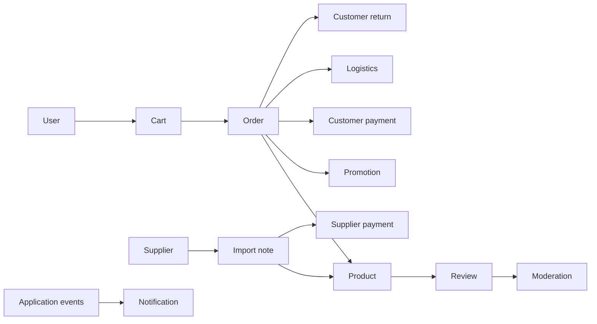

# NewToyStore Backend

## Overview

The backend is a Java 21 and Spring Boot 3.3.5 REST API for the NewToyStore platform. It implements catalog, inventory, carts, orders, payments, logistics, returns, suppliers, promotions, reviews, notifications, authentication and administrative reporting.

The application is a modular monolith: business capabilities live in separate top-level packages but run in one Spring Boot process and use one MySQL schema. Cross-domain references commonly use scalar IDs, application facades and Spring application events.

## Technology stack

- Java 21, Spring Boot 3.3.5 and Maven Wrapper.
- Spring Web, Spring Data JPA, Spring Security and Bean Validation.
- Springdoc OpenAPI with Swagger UI.
- Stateless JWT authentication and BCrypt password hashing.
- MySQL, Hibernate and Flyway migrations.
- Spring Mail, Cloudinary and VNPay integrations.
- Lombok and handwritten mapper classes.

## Architecture

```text
HTTP controller and DTO
          |
          v
Application service or facade
          |
          v
Domain entity and repository abstraction
          |
          v
JPA repository or external integration
```

The code follows a pragmatic DDD Lite structure. Domain packages own their entities, application workflows, repository abstractions and web DTOs. Shared exceptions, base entities and events live under `global`; security, schedules, integrations and specifications live under `infrastructure`.

## Source structure

```text
src/main/java/com/example/new_toy_store/
|- admin/                 Administrative badge aggregation
|- cart/                  Cart and checkout initiation
|- category/              Hierarchical categories
|- customer_payment/      Customer payments and refunds
|- customer_return/       Customer return lifecycle
|- imports/               Supplier inbound notes
|- logistics/             Shipments and tracking
|- moderation/            Review moderation vocabulary
|- notification/          Notifications and preferences
|- order/                 Orders and lifecycle history
|- product/               Products, variants and inventory
|- promotion/             Discounts and usage
|- review/                Reviews, media and replies
|- statistics/            Administrative reporting
|- supplier/              Supplier master data
|- supplier_payment/      Supplier invoices and transactions
|- supplier_return/       Returns to suppliers
|- upload/                Media upload integration
|- user/                  Accounts and authentication
|- warehouse/             Warehouse workflows
|- global/                Shared technical primitives
`- infrastructure/        Security and external adapters
```

## Domain documentation

| Domain | Documentation |
|---|---|
| Admin | [admin](src/main/java/com/example/new_toy_store/admin/README.md) |
| Cart | [cart](src/main/java/com/example/new_toy_store/cart/README.md) |
| Category | [category](src/main/java/com/example/new_toy_store/category/README.md) |
| Customer payment | [customer_payment](src/main/java/com/example/new_toy_store/customer_payment/README.md) |
| Customer return | [customer_return](src/main/java/com/example/new_toy_store/customer_return/README.md) |
| Imports | [imports](src/main/java/com/example/new_toy_store/imports/README.md) |
| Logistics | [logistics](src/main/java/com/example/new_toy_store/logistics/README.md) |
| Moderation | [moderation](src/main/java/com/example/new_toy_store/moderation/README.md) |
| Notification | [notification](src/main/java/com/example/new_toy_store/notification/README.md) |
| Order | [order](src/main/java/com/example/new_toy_store/order/README.md) |
| Product | [product](src/main/java/com/example/new_toy_store/product/README.md) |
| Promotion | [promotion](src/main/java/com/example/new_toy_store/promotion/README.md) |
| Review | [review](src/main/java/com/example/new_toy_store/review/README.md) |
| Statistics | [statistics](src/main/java/com/example/new_toy_store/statistics/README.md) |
| Supplier | [supplier](src/main/java/com/example/new_toy_store/supplier/README.md) |
| Supplier payment | [supplier_payment](src/main/java/com/example/new_toy_store/supplier_payment/README.md) |
| Supplier return | [supplier_return](src/main/java/com/example/new_toy_store/supplier_return/README.md) |
| Upload | [upload](src/main/java/com/example/new_toy_store/upload/README.md) |
| User | [user](src/main/java/com/example/new_toy_store/user/README.md) |
| Warehouse | [warehouse](src/main/java/com/example/new_toy_store/warehouse/README.md) |

## Main business flows



Purchase fulfillment starts with cart validation, creates order snapshots, reserves inventory, initializes COD or VNPay payment, creates a shipment and records tracking until completion. Completed imports update inventory and create supplier payables. Customer and supplier returns coordinate inspection, logistics and stock changes.

## Persistence and transactions

- MySQL is the primary database; checked-in Flyway migrations currently run from `V1` through `V7`.
- JPA uses disabled Open Session in View, batch fetching and JDBC batching.
- Root records generally support timestamps, soft deletion and optimistic versions.
- Payment, refund and shipment write paths use row locking where concurrent updates matter.
- Orders and related records preserve product, price and attribute snapshots to keep historical data stable.

Known persistence debt: supplier-payment tables are mapped in code but are not represented by the checked-in migrations. The project also combines Flyway with Hibernate schema update, so schema ownership should be unified.

## Security

Authentication is stateless JWT. Roles are `CUSTOMER`, `STAFF`, `MANAGER` and `ADMIN`. URL rules and method-level authorization protect administrative workflows, while registration, login, password recovery, selected catalog reads and VNPay callbacks are public.

Known routing mismatch: the security matcher uses `/cart/**`, while the cart controller uses `/carts/**`. Requests remain authenticated through the fallback rule, but the intended role restriction is not applied at that matcher.

## Setup and run

Requirements:

- JDK 21.
- MySQL reachable through the configured JDBC URL.
- Credentials for optional mail, VNPay and Cloudinary integrations.

Supported configuration names include:

```text
DB_URL, DB_USERNAME, DB_PASSWORD, PORT
FRONTEND_BASE_URL, BACKEND_BASE_URL
MAIL_HOST, MAIL_PORT, MAIL_USERNAME, MAIL_PASSWORD
JWT_SECRET, DEFAULT_AVATAR_URL
VNPAY_ENABLED, VNPAY_PAY_URL, VNPAY_REFUND_URL
VNPAY_TMN_CODE, VNPAY_HASH_SECRET, VNPAY_RETURN_URL, VNPAY_IPN_URL
CLOUDINARY_CLOUD_NAME, CLOUDINARY_API_KEY, CLOUDINARY_API_SECRET, CLOUDINARY_FOLDER
SEED_ADMIN_*, SEED_STAFF_*, SEED_MANAGER_*, SEED_CUSTOMER_*
```

Do not commit real credentials. `DB_URL`, `DB_USERNAME` and `DB_PASSWORD` must identify the MySQL instance used by the application.

```powershell
.\mvnw.cmd spring-boot:run
```

Run verification with:

```powershell
.\mvnw.cmd test
```

No backend test source files were detected when this documentation was prepared. API routes and domain-specific limitations are documented in the linked domain READMEs.

## API documentation

When the backend is running, the generated OpenAPI document is available at `/v3/api-docs` and Swagger UI is available at `/swagger-ui.html`. Availability still follows the active security configuration.

## Current technical debt

- Add unit and integration coverage for state transitions, checkout, locking, callbacks and returns.
- Align the cart security matcher with the controller route.
- Add missing migrations and choose one schema authority.
- Require externally supplied JWT signing configuration.
- Standardize API path prefixes and versioning.
- Continue reducing direct cross-domain imports where asynchronous events or explicit ports are suitable.
