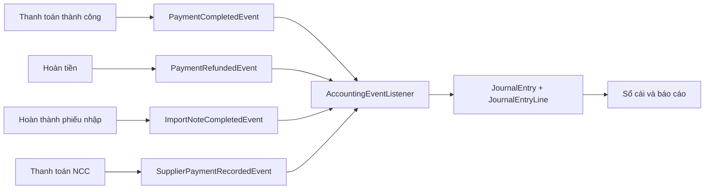

# Domain Kế toán và Dòng tiền

## 1. Mục đích

Domain `accounting` cung cấp sổ kế toán kép nội bộ cho NewToyStore. Module ghi nhận các biến động phát sinh từ bán hàng, hoàn tiền, nhập hàng và thanh toán nhà cung cấp; đồng thời cung cấp số dư tài khoản, nhật ký chung, sổ cái và báo cáo quản trị.

Phạm vi hiện tại **không bao gồm** kết nối ngân hàng thật, đồng bộ sao kê hoặc đối soát ngân hàng. Tài khoản `112` chỉ là số dư nội bộ đại diện cho tiền gửi hoặc ví thanh toán.

## 2. Nguyên tắc cốt lõi

Mỗi nghiệp vụ được ghi thành một `JournalEntry` có từ hai `JournalEntryLine` trở lên và phải thỏa mãn:

```text
Tổng phát sinh Nợ = Tổng phát sinh Có
```

Mỗi dòng chỉ được ghi một phía: hoặc Nợ, hoặc Có. Bút toán không cân bằng hoặc dòng có giá trị ở cả hai phía sẽ bị từ chối.

Bút toán đã ghi không bị sửa hoặc xóa để che mất lịch sử. Khi cần sửa sai, ADMIN tạo bút toán đảo với Nợ/Có ngược lại bút toán gốc.

## 3. Cấu trúc module

```text
accounting/
|- api/
|  |- AccountingController.java
|  `- advice/AccountingExceptionHandler.java
|- application/
|  |- AccountingFacade.java
|  |- AccountingService.java
|  |- InternalFundQuery.java
|  |- dto/
|  `- listener/AccountingEventListener.java
`- domain/
   |- LedgerAccount.java
   |- JournalEntry.java
   |- JournalEntryLine.java
   |- repository abstractions
   |- enums
   `- exception/
```

- `LedgerAccount`: định nghĩa tài khoản và quy tắc tính số dư.
- `JournalEntry`: đầu bút toán, nguồn nghiệp vụ, trạng thái và người ghi.
- `JournalEntryLine`: dòng phát sinh Nợ hoặc Có của một tài khoản.
- `AccountingService`: kiểm tra cân đối, ghi sổ, đảo bút toán và lập báo cáo.
- `AccountingEventListener`: chuyển domain event từ module khác thành bút toán tự động.
- `InternalFundQuery`: cung cấp số tiền thanh khoản cho nghiệp vụ thanh toán NCC.

## 4. Hệ thống tài khoản mặc định

Migration `V8__create_internal_accounting.sql` tạo ba bảng kế toán và khởi tạo các tài khoản:

| Mã | Tên | Loại | Số dư thông thường | Ý nghĩa |
|---|---|---|---|---|
| `111` | Tiền mặt tại cửa hàng | Tài sản | Nợ | Tiền COD và tiền mặt nội bộ |
| `112` | Tiền gửi và ví thanh toán | Tài sản | Nợ | Tiền thanh toán điện tử theo dõi nội bộ |
| `156` | Hàng hóa trong kho | Tài sản | Nợ | Giá vốn hàng còn trong kho |
| `331` | Phải trả nhà cung cấp | Nợ phải trả | Có | Công nợ với nhà cung cấp |
| `411` | Vốn chủ sở hữu | Vốn chủ | Có | Vốn ban đầu và vốn bổ sung |
| `511` | Doanh thu bán hàng | Doanh thu | Có | Doanh thu từ thanh toán thành công |
| `521` | Giảm trừ và hoàn tiền | Doanh thu đối ứng | Nợ | Khoản hoàn tiền làm giảm doanh thu |
| `632` | Giá vốn hàng bán | Chi phí | Nợ | Giá vốn của sản phẩm đã bán |
| `642` | Chi phí vận hành | Chi phí | Nợ | Chi phí quản trị ghi nhận thủ công |

## 5. Luồng ghi sổ tự động



Listener chạy ở pha `AFTER_COMMIT`, vì vậy domain kế toán chỉ ghi nhận nghiệp vụ nguồn sau khi transaction nghiệp vụ đó hoàn tất.

### Thanh toán khách hàng

```text
Nợ 111 (COD) hoặc 112 (điện tử)
    Có 511 - Doanh thu

Nợ 632 - Giá vốn
    Có 156 - Hàng hóa trong kho
```

Phần giá vốn chỉ được ghi khi event có `costAmount > 0`.

### Hoàn tiền khách hàng

```text
Nợ 521 - Giảm trừ doanh thu
    Có 111 hoặc 112
```

### Hoàn thành phiếu nhập

```text
Nợ 156 - Hàng hóa trong kho
    Có 331 - Phải trả nhà cung cấp
```

### Thanh toán nhà cung cấp

```text
Nợ 331 - Phải trả nhà cung cấp
    Có 111 hoặc 112
```

Trước khi trả NCC, `SupplierPaymentService` dùng `InternalFundQuery` để kiểm tra tổng tiền thanh khoản. Nghiệp vụ bị từ chối nếu số tiền trả lớn hơn số tiền nội bộ đang có.

## 6. Idempotency và tính nhất quán

Mỗi bút toán tự động có cặp khóa duy nhất:

```text
source_type + source_reference
```

Ví dụ: `CUSTOMER_PAYMENT + PAYMENT-25`. Nếu cùng một event được gửi lại, service trả về bút toán đã có thay vì cộng số liệu lần thứ hai. Database tiếp tục bảo vệ bằng unique constraint `uk_journal_source`.

Số tiền được lưu bằng `DOUBLE` để đồng bộ với phần còn lại của dự án. Mọi tổng hợp nghiệp vụ được làm tròn hai chữ số bằng `Math.round` trước khi ghi hoặc trả kết quả.

## 7. Số dư và báo cáo

- **Danh mục tài khoản:** tổng Nợ, tổng Có và số dư của từng tài khoản.
- **Nhật ký chung:** danh sách bút toán theo nguồn phát sinh.
- **Sổ cái:** các dòng phát sinh của một tài khoản trong khoảng ngày.
- **Bảng cân đối thử:** kiểm tra tổng Nợ và tổng Có toàn hệ thống.
- **Kết quả kinh doanh:** doanh thu gộp, hoàn tiền, doanh thu thuần, giá vốn, chi phí vận hành và lợi nhuận.
- **Dashboard dòng tiền:** tiền mặt, tiền điện tử, thanh khoản, tồn kho, công nợ NCC, nợ quá hạn và khả năng thanh toán.

Công thức chính:

```text
Doanh thu thuần = Doanh thu 511 - Giảm trừ 521
Tổng chi phí = Giá vốn 632 + các tài khoản chi phí khác
Lợi nhuận = Doanh thu thuần - Tổng chi phí
Tiền còn lại sau công nợ = Tổng tiền thanh khoản - Công nợ NCC
Khả năng chi an toàn = max(0, Tổng tiền thanh khoản - Mức dự phòng)
```

`ledgerAccountsPayable` lấy từ tài khoản `331`, còn `supplierOutstanding` lấy từ các hóa đơn của module `supplier_payment`. Hai số liệu nên được theo dõi cùng nhau để phát hiện nghiệp vụ nguồn chưa được ghi sổ hoặc dữ liệu lịch sử chưa được chuyển đổi.

## 8. API và phân quyền

Base path: `/api/accounting`.

| Method | Endpoint | Chức năng | Quyền |
|---|---|---|---|
| GET | `/dashboard` | Tổng quan quỹ, công nợ và lợi nhuận | MANAGER, ADMIN |
| GET | `/accounts` | Số dư hệ thống tài khoản | MANAGER, ADMIN |
| GET | `/journal-entries` | Danh sách nhật ký chung | MANAGER, ADMIN |
| GET | `/journal-entries/{id}` | Chi tiết bút toán | MANAGER, ADMIN |
| GET | `/general-ledger/{accountCode}` | Sổ cái theo tài khoản | MANAGER, ADMIN |
| GET | `/reports/trial-balance` | Bảng cân đối thử | MANAGER, ADMIN |
| GET | `/reports/income-statement` | Báo cáo kết quả kinh doanh | MANAGER, ADMIN |
| POST | `/journal-entries` | Tạo bút toán thủ công | ADMIN |
| POST | `/journal-entries/{id}/reverse` | Đảo bút toán | ADMIN |

Các API danh sách hỗ trợ `Pageable`; báo cáo hỗ trợ `asOf` hoặc `from`/`to` theo định dạng ISO `yyyy-MM-dd`.

## 9. Bút toán số dư đầu kỳ

Hệ thống không tự suy đoán tiền vốn ban đầu. ADMIN cần tạo bút toán `OPENING_BALANCE` trước khi sử dụng chức năng thanh toán NCC.

Ví dụ cửa hàng có 20 triệu tiền mặt và 30 triệu tiền trong tài khoản:

```json
{
  "entryDate": "2026-08-13",
  "description": "Ghi nhận số dư đầu kỳ",
  "sourceType": "OPENING_BALANCE",
  "sourceReference": "OPENING-2026-01",
  "lines": [
    { "accountCode": "111", "description": "Tiền mặt đầu kỳ", "debitAmount": 20000000, "creditAmount": 0 },
    { "accountCode": "112", "description": "Tiền gửi đầu kỳ", "debitAmount": 30000000, "creditAmount": 0 },
    { "accountCode": "411", "description": "Vốn chủ sở hữu đầu kỳ", "debitAmount": 0, "creditAmount": 50000000 }
  ]
}
```

Các loại nguồn được phép nhập thủ công gồm `OPENING_BALANCE`, `OWNER_CAPITAL`, `OPERATING_EXPENSE`, `FUND_TRANSFER` và `MANUAL_ADJUSTMENT`. Nguồn nghiệp vụ tự động không được giả lập qua API thủ công.

## 10. Giao diện quản trị

Frontend cung cấp trang `/admin/accounting` với các nhóm:

- Tổng quan quỹ.
- Nhật ký chung.
- Sổ cái.
- Báo cáo.
- Ghi nhận thủ công và đảo bút toán dành cho ADMIN.

## 11. Giới hạn và hướng phát triển

- Chưa kết nối tài khoản ngân hàng thật và chưa đối soát sao kê.
- Chưa có khóa kỳ kế toán; hiện vẫn có thể ghi bút toán vào ngày quá khứ.
- Chưa tự động chuyển các giao dịch tồn tại trước migration V8 thành bút toán lịch sử.
- Chưa có thuế GTGT, công nợ phải thu B2B, phân bổ chi phí hoặc báo cáo dòng tiền theo chuẩn kế toán.
- Số tiền dùng `DOUBLE` theo thiết kế chung của dự án; hệ thống tài chính thực tế nên cân nhắc `DECIMAL`/`BigDecimal`.
- Cần bổ sung test cho cân đối Nợ/Có, idempotency, đảo bút toán và ghi nhận event đồng thời.
